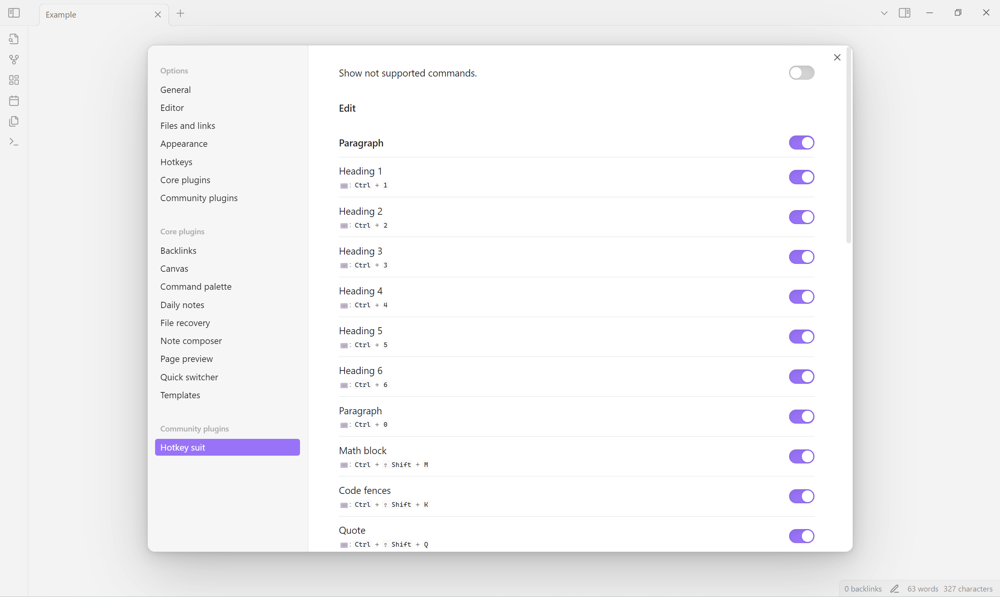
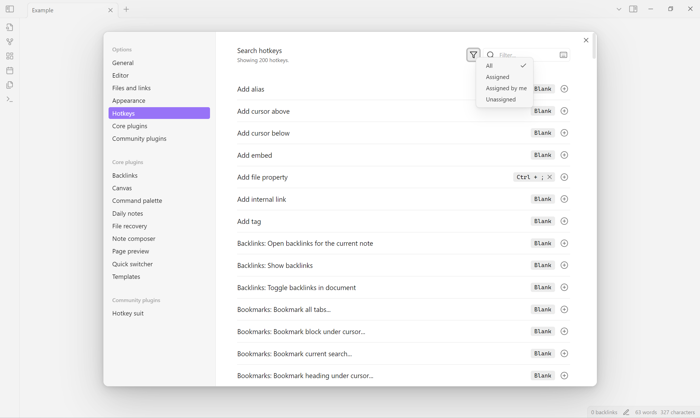
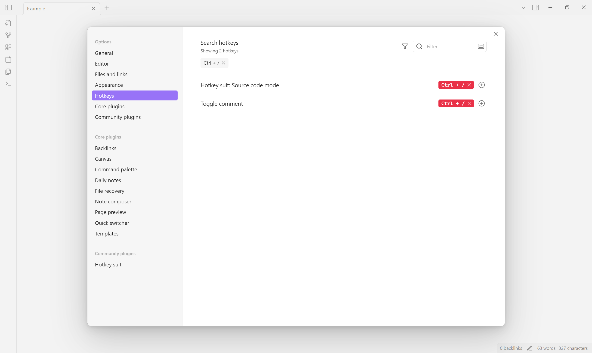

<!--
 * @Author       sleepingraven
 * @Date         2025-01-25 14:27:45
 * @LastEditors  sleepingraven
 * @LastEditTime 2025-02-13 11:00:07
 * @FilePath     \hotkey-suit\README.md
 * @Description  这是默认设置,请设置`customMade`, 打开koroFileHeader查看配置 进行设置: https://github.com/OBKoro1/koro1FileHeader/wiki/%E9%85%8D%E7%BD%AE
-->
# Obsidian Hotkey Suit

This plugin lists a set of shortcuts from [Typora](https://support.typora.io/Shortcut-Keys/), which can be enabled in *setting tab*.

## Usage

1. Select **Settings → Community plugins → Hotkey suit**.
   - Choose a Hotkey suit command to enable.
   
2. Select **Settings → Options → Hotkeys**.
   - Select **() → Assigned**, or search by command name or hotkey.
   
   - You can see and disable conflicting hotkeys that in *error* color.
   

## Limitation

1. Since there is not an exposed interface to open **Settings → Options → Hotkeys**, you need to select manually.
2. You may not disable a Hotkey suit command (name in the form of "Hotkey suit: …") under **Settings → Options → Hotkeys** because there is not an associated event to disable plugin's setting.
    If you did, you can select **() → Assigned by me** or search by name to find that command and restore default.

## installation

### [Install from community plugins](https://help.obsidian.md/Extending+Obsidian/Community+plugins#Install+a+community+plugin)

### Install manually

1. Open [latest release](https://github.com/sleepingraven/obsidian-chat-clips/releases/latest).
2. Download `main.js`, `manifest.json` and `styles.css` to `<obsidian-vault>/.obsidian/plugins/hotkey-suit`.
