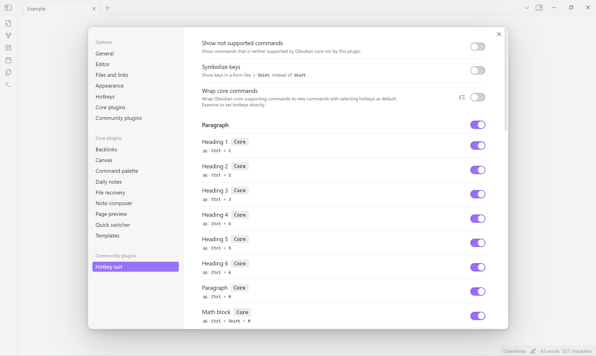
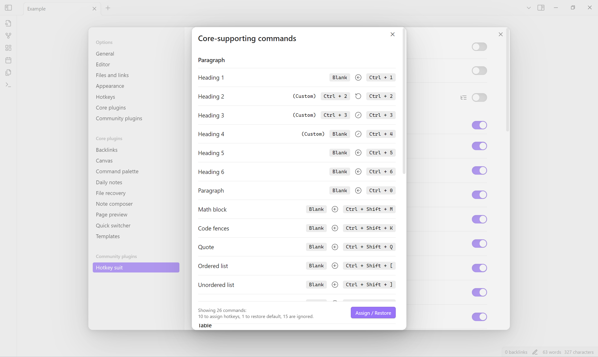
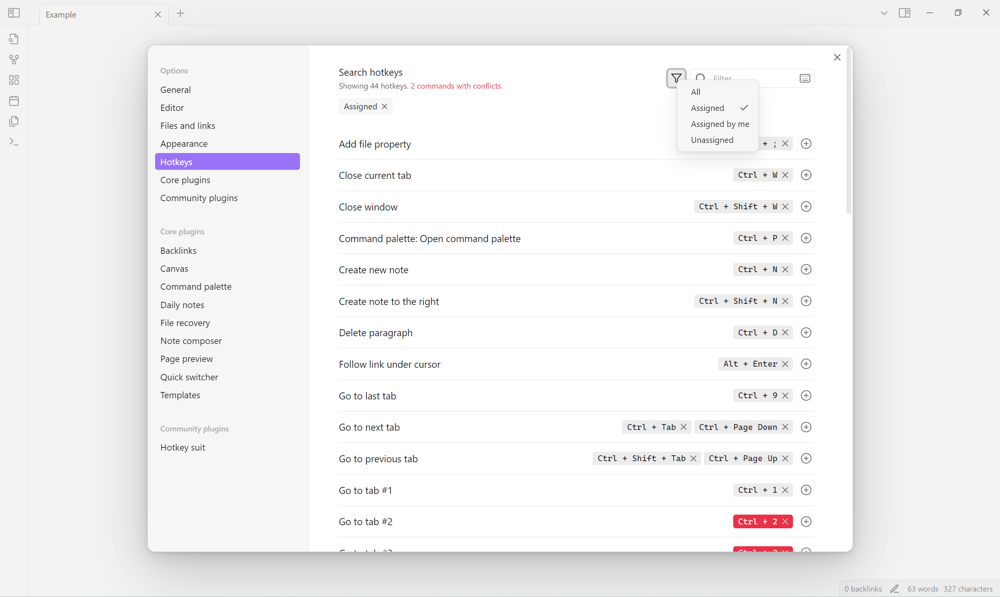

<!--
 * @Author       sleepingraven
 * @Date         2025-01-25 14:27:45
 * @LastEditors  sleepingraven
 * @LastEditTime 2025-02-13 11:00:07
 * @FilePath     \hotkey-suit\README.md
 * @Description  这是默认设置,请设置`customMade`, 打开koroFileHeader查看配置 进行设置: https://github.com/OBKoro1/koro1FileHeader/wiki/%E9%85%8D%E7%BD%AE
-->
# Hotkey Suit

This plugin lists a set of shortcuts from [Typora](https://support.typora.io/Shortcut-Keys/).

## Usage

### 1. Choose hotkeys

1. Select **Settings → Community plugins → Hotkey suit**.
2. Choose preferred hotkeys to enable.

### 2. Config core commands

This plugin allows wrap commands from Obsidian core, or set hotkeys directly.

- **Wrap core commands** creates new corresponding commands with enabled hotkeys as default.
- Next to **Wrap core commands**, select **Examine ()** to assign enabled hotkeys or restore default directly.

### 3. Resolve hotkey conflicts

1. Select **Settings → Options → Hotkeys**.
2. Select **() → Assigned**, or search by command name or hotkey.
3. Conflicting hotkeys are in *error* color.

## Installation

### [Install from community plugins](https://help.obsidian.md/Extending+Obsidian/Community+plugins#Install+a+community+plugin)

### Install manually

1. Open [latest release](https://github.com/sleepingraven/obsidian-chat-clips/releases/latest).
2. Download `main.js`, `manifest.json` and `styles.css` to `<obsidian-vault>/.obsidian/plugins/hotkey-suit`.
